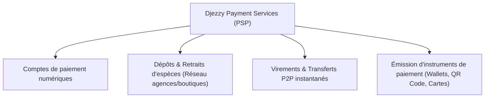

Demandez à n'importe quel Algérien comment il paie ses courses au supermarché, son café le matin ou son matériel informatique à Belfort : la réponse est invariablement la même. Un billet bleu de 1 000 DA ou un billet vert de 2 000 DA sortis d'une liasse soigneusement pliée au fond de la poche. 

Le règne du cash (la fameuse *« Chkara »*) en Algérie n'est pas un choix d'amour pour le papier : c'est le résultat direct d'un système bancaire traditionnel lourd, de distributeurs de billets (DAB) trop souvent vides ou hors service, et d'un taux de bancarisation qui plafonne malgré les efforts louables d'Algérie Poste et de la carte Edahabia.

Mais le **23 septembre 2026**, une onde de choc discrète mais historique a traversé le paysage financier national : **le Conseil monétaire et bancaire de la Banque d'Algérie a officiellement autorisé la constitution de « Djezzy Payment Services » en tant que Prestataire de Services de Paiement (PSP)**.

Pour la toute première fois dans l'histoire des télécoms algériennes, un opérateur mobile obtient le sésame pour opérer directement dans l'arène des services financiers.

En tant que développeur web et observateur attentif de la tech en Algérie, cette annonce sonne comme une délivrance. Décortiquons ensemble ce que cela change, pourquoi c'est un séisme économique et technique, et ce que la communauté des développeurs attend impatiemment.

---

## 1. Djezzy Payment Services : De quoi s'agit-il exactement ?

Soyons précis sur les termes juridiques et réglementaires pour dissiper tout malentendu :

*   **Une autorisation de constitution préalable :** La décision rendue par la Banque d'Algérie le 23 septembre 2026 constitue une *autorisation de constitution* de la filiale dédiée d'Optimum Telecom Algérie (Djezzy).
*   **Le compte à rebours est lancé :** En vertu du règlement n° 25-02 pris en application de la **loi n° 23-09 portant loi monétaire et bancaire**, Djezzy dispose désormais d'un délai légal maximal de **12 mois** pour formaliser sa structure, auditer ses systèmes et déposer sa demande d'**agrément définitif**.
*   **L'entrée en vigueur opérationnelle :** C'est une fois cet agrément définitif en poche que Djezzy pourra commercialiser et déployer ses services au grand public.

Ce statut de **PSP (Prestataire de Services de Paiement)** est une créature juridique récente dans le droit algérien, introduite spécifiquement par la refonte monétaire pour briser le monopole exclusif des banques traditionnelles sur les flux transactionnels du quotidien.

---

## 2. PSP vs Banque classique : Ce que Djezzy va pouvoir faire

Une question revient souvent : *est-ce que Djezzy devient une banque ?* 

La réponse est **non, et c'est précisément ce qui fait sa force**.

Un Prestataire de Services de Paiement n'accorde pas de crédits immobiliers et ne spécule pas sur les marchés financiers. Il se focalise sur l'essentiel de la circulation monétaire dématérialisée :



Concrètement, les prérogatives accordées par la Banque d'Algérie couvrent :

1.  **L'ouverture et la gestion de comptes de paiement :** Tout utilisateur possédant une ligne mobile pourra ouvrir en quelques secondes un compte financier vérifié (KYC simplifié).
2.  **Le dépôt et le retrait d'espèces :** Transformer du cash physique en solde numérique (et inversement) directement auprès des milliers de boutiques et points de vente Djezzy répartis sur les 58 wilayas.
3.  **Les transferts de fonds de particulier à particulier (P2P) :** Envoyer 2 000 DA à un ami ou à un proche instantanément, de numéro à numéro, sans attendre 48 heures de compensation interbancaire.
4.  **L'émission de moyens de paiement électroniques :** Portefeuilles électroniques (Wallets mobiles), paiements par QR Code chez les commerçants de quartier et éventuellement cartes prépayées virtuelles ou physiques.

---

## 3. L'effet de levier télécom : Pourquoi le Mobile Money va écraser le cash

Pourquoi un opérateur télécom comme Djezzy peut-il réussir là où les banques conventionnelles peinent depuis vingt ans ? 

La réponse tient en trois chiffres : **l'infrastructure, le maillage territorial et le smartphone**.

### L'expérience mondiale (M-Pesa, Wave, Orange Money)
En Afrique subsaharienne et en Asie du Sud-Est, la révolution de l'inclusion financière ne s'est pas faite par les agences bancaires en marbre, mais par le téléphone portable. Le Kenya avec *M-Pesa*, ou le Sénégal et la Côte d'Ivoire avec *Wave* et *Orange Money*, ont démontré qu'un boucher, un chauffeur de taxi ou une épicerie de village adopte le paiement digital dès lors que le processus prend 3 secondes sur son écran et ne nécessite aucun dossier papier de 12 pages.

### La force de frappe de Djezzy en Algérie
Djezzy compte aujourd'hui **plus de 15 millions d'abonnés actifs**, des centaines d'agences officielles et des dizaines de milliers de points de vente agréés (les fameuses boutiques de rechargement Flexy présentes dans chaque ruelle du pays).

Imaginez un instant : chaque kiosque qui vous vend actuellement une carte de recharge ou un paquet de chewing-gum devient potentiellement un guichet de dépôt et retrait d'argent liquide. Plus besoin de chercher désespérément un distributeur postal un jeudi soir à 21h : la liquidité est décentralisée dans tout le pays.

---

## 4. L'angle développeur : Ce qu'on attend techniquement de Djezzy

C'est ici que le sujet devient passionnant pour nous autres développeurs, éditeurs de logiciels SaaS et créateurs de plateformes e-commerce locales.

### Le calvaire actuel de l'intégration CIB / SATIM
Quiconque a déjà tenté d'intégrer le paiement en ligne en Algérie connaît l'épreuve :
*   Des démarches administratives interminables avec la SATIM et les banques partenaires.
*   Des kits de développement (SDK) souvent vieillissants, articulés autour de redirections lourdes vers des pages de paiement datant d'une autre décennie.
*   L'obligation pour l'utilisateur final de sortir sa carte physique CIB ou Edahabia, de taper 16 chiffres, une date d'expiration, un CVV et d'attendre un code OTP par SMS qui arrive parfois... après l'expiration de la session.
*   L'abandon de panier qui frôle souvent les 70 % sur les sites de vente en ligne algériens.

### Le rêve : Une API moderne et des paiements in-app
Si Djezzy Payment Services veut conquérir l'écosystème numérique, son équipe d'ingénieurs doit absolument penser **"Developer-First"** :

*   **Une véritable API REST / GraphQL documentée :** À l'image de ce que proposent Stripe ou Paystack dans d'autres régions, avec sandbox immédiate pour les développeurs.
*   **Webhooks fiables et temps réel :** Pour valider les commandes instantanément sans pooling de requêtes.
*   **Paiement en 1-Clic ou par Push Notification :** L'acheteur clique sur « Payer avec Djezzy », reçoit une notification biométrique (Face ID / empreinte) sur son application mobile Djezzy, valide en 2 secondes, et le paiement est confirmé.
*   **Le paiement par QR Code dynamique :** Permettre aux développeurs de générer des QR Codes de paiement sur les terminaux de caisse (POS) pour les restaurants, supérettes et commerces physiques.

```typescript
// Ce à quoi devrait ressembler l'intégration idéale pour un dev algérien
const payment = await djezzyPay.charges.create({
  amount: 2500, // 2 500 DZD
  currency: 'DZD',
  customer_phone: '0770XXXXXX',
  order_id: 'CMD-2026-9842',
  description: 'Abonnement mensuel SaaS Pro',
  callback_url: 'https://mon-saas.dz/api/webhook/djezzy'
});
```

Si Djezzy ouvre son API aux startups, aux freelances et aux plateformes locales, le marché du e-commerce et des services à la demande en Algérie connaîtra une explosion exponentielle.

---

## 5. Les défis et zones d'ombre à surveiller

L'enthousiasme est immense, mais il ne faut pas occulter les obstacles de taille qui attendent Djezzy Payment Services au cours des 12 prochains mois :

### 1. L'interopérabilité nationale
Le pire scénario serait un système fermé ("walled garden") où un client Djezzy ne peut payer qu'un marchand Djezzy. La Banque d'Algérie et le GIE Monétique devront veiller à ce que les futurs PSP (Mobilis et Ooredoo ne tarderont certainement pas à emboîter le pas) soient **100 % interopérables** entre eux et avec le réseau CIB / Edahabia existant. Un virement d'un portefeuille Djezzy vers un compte CCP ou BNA doit se faire de manière transparente et sans friction.

### 2. La grille tarifaire (Fee Structure)
Le cash a un avantage imbattable aux yeux du commerçant de quartier : il est perçu comme "gratuit" (même si la gestion physique des espèces a un coût caché important). Si Djezzy applique des commissions trop élevées par transaction, les petits commerçants refuseront le terminal mobile. Le succès de Wave en Afrique de l'Ouest repose sur des frais fixes ultra-faibles (1 %) et des dépôts/retraits gratuits : c'est ce modèle low-cost et haute-fréquence qui devra inspirer l'opérateur.

### 3. La sécurité et la fraude (Social Engineering)
Avec la démocratisation du paiement sur smartphone viendra inévitablement la cybercriminalité : tentatives de phishing par SMS, faux agents du service client demandant les codes secrets, et usurpation d'identité. Djezzy devra déployer une sécurité sans faille (chiffrement de bout en bout, détection de fraude par intelligence artificielle, authentification multifacteur obligatoire) tout en menant une campagne massive d'éducation civique sur la sécurité numérique.

---

## Conclusion : Un cap décisif pour la souveraineté économique

L'autorisation accordée à **Djezzy Payment Services** le 23 septembre 2026 n'est pas une simple formalité administrative. C'est l'acte de naissance officiel du **Mobile Money à grande échelle en Algérie**.

En ouvrant la voie aux opérateurs télécoms pour digitaliser les flux monétaires du quotidien, l'Algérie pose enfin la première pierre indispensable pour sortir de la dépendance au cash, injecter la masse monétaire informelle dans le circuit régulé et offrir à toute une génération de développeurs et d'entrepreneurs les outils de paiement modernes dont ils ont été privés trop longtemps.

La balle est désormais dans le camp des équipes techniques et stratégiques de Djezzy pour finaliser leur infrastructure et transformer cette promesse réglementaire en succès populaire dans nos smartphones.

---

*Que pensez-vous de l'arrivée de Djezzy dans les services de paiement ? Préféreriez-vous payer vos achats quotidiens par votre téléphone plutôt qu'en liquide ou par carte bancaire ? Partagez vos impressions et vos attentes de développeur ou d'utilisateur en commentaire !*

## sources

*   **Djezzy Payment Services autorisé à se constituer en prestataire de services de paiement :** [aps.dz](https://www.aps.dz/fr/economie/banque-et-finances/mudzkq06-djezzy-payment-services-autorise-a-se-constituer-en-prestataire-de-services-de-paiement)
